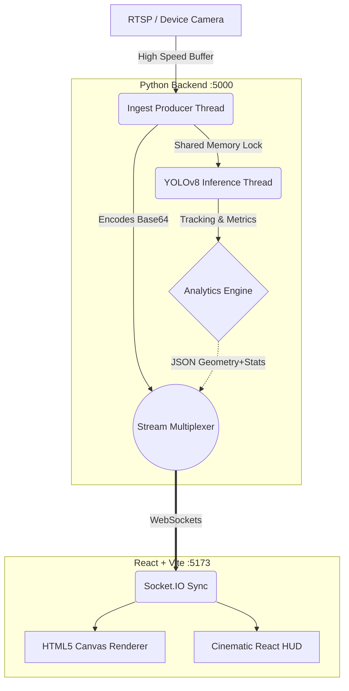

<div align="center">

# 🌐 5G Edge Network Queue Analytics

**An ultra-low latency, decentralized, AI-powered spatial crowd telemetry system.**

[](https://python.org)
[](https://flask.palletsprojects.com/)
[](https://reactjs.org/)
[](https://vitejs.dev/)
[](https://tailwindcss.com/)
[](https://developer.nvidia.com/cuda-toolkit)

</div>

---

## 🚀 The Vision

Traditional camera analytics suffer from heavy bandwidth constraints, cloud computing latency, and fragmented dashboards. 

This project solves this by moving **YOLOv8 Computer Vision directly to the 5G Edge**. It strips away heavy image transmission, instead sending pure, serialized geometric metadata over ultra-fast WebSockets. The result? A **cinematic, GPU-accelerated client-side dashboard** that monitors spatial ROI (Region of Interest) queue wait times with absolute zero perceived lag.

<br>

<div align="center">
  
  <p><em>The cinematic "Mission Control" Aether Edge telemetry interface.</em></p>
</div>

---

## ⚡ Key Features

> [!TIP]
> **Why this matters:** This isn't just an AI script. It's a complete decoupled ecosystem engineered for production deployment on edge appliances.

*   **Real-time AI Producer-Consumer Pipeline**: Completely eliminates CPU bottlenecking. A thread grabs video layers at maximum speed, while an asynchronous AI consumer selectively processes frames naturally based on hardware availability.
*   **WebSockets + Binary Telemetry**: Traditional REST HTTP polling is too slow for 5G. We broadcast real-time metrics (`total_people`, `people_in_queue`, `density`, `estimated_wait`) encoded in high-speed binary packets via Socket.IO.
*   **Decentralized GPU Rendering**: Instead of python `cv2.rectangle` operations blocking the AI thread, pure JSON telemetry logic is mapped and drawn using native HTML5 `<canvas>` on the *client's user-agent* for 60FPS UI rendering.
*   **Advanced Spatial Wait-Time Estimation**: A statistical queue predictor calculates exponential moving averages to predict physical clearing times dynamically based on ROI density tracking.

<br/>

## 🗺️ Architectural Topography



---

## ⚙️ Getting Started

### 1️⃣ Dependencies & Requirements
You will need an environment capable of running **Python 3.10+** and **Node.js 18+**. 
(If you are on Windows, ensure the `C++ Build Tools` are installed if you plan on compiling deep-learning bindings manually).

### 2️⃣ Python Backend Setup
Initialize the AI inference engine which runs Flask and the ONNX models:

```bash
# Clone the repository
git clone https://github.com/ojas4414/5G_Usecase.git
cd 5G_Usecase

# Create a clean virtual environment and activate it
python -m venv venv
source venv/bin/activate  # On Windows use: .\venv\Scripts\activate

# Install AI plugins (Torch, ONNX, Flask-SocketIO)
pip install -r requirements.txt
```

### 3️⃣ Edge Config Optimization
Open `config.yaml` to configure your specific camera deployment point:

```yaml
node_id: "EDGE-NYC-5G-01"
roi_polygon:           # [X, Y] array of coordinates defining the 'Queue'
  - [200, 200]
  - [800, 200]
  ...
video_source: 0        # 0 for webcam, or "rtsp://..." for professional 5G Cameras
```

### 4️⃣ React Frontend Setup
Launch the dark-mode cybernetic dashboard:

```bash
cd frontend

# Install Vite, Tailwind v4, React, Chart.js dependencies
npm install

# Start the local development server natively 
npm run dev
```

---

## 🛸 Operation & Deployment

To launch the entire platform:

1.   **Start the AI Edge Protocol**:
     In terminal #1: `python app.py` 
     *The server will boot on `localhost:5000` and load the YOLOv8n.onnx graph.*
2.   **Start the Telemetry Interface**:
     In terminal #2: `npm run dev` in the frontend directory.
3.   Open your browser to: **`http://localhost:5173`**

You should instantly see the cybernetic landing section. Click **"View Live Dashboard"** to watch the real-time AI canvas rendering and telemetry metrics update instantaneously via WebSockets!

---

> [!IMPORTANT]
> **NVIDIA CUDA Execution**
> 
> The project utilizes `ONNX Runtime`. By default, it will fall back to `CPUExecutionProvider`. To utilize lightning-fast hardware acceleration, ensure you have correctly installed your NVIDIA Drivers and the CUDA Toolkit. The `processor.py` engine will automatically hook into CUDA cores if discovered.

---

<div align="center">
<br/>
<p><b>Built for the future of distributed decentralized edge computing.</b></p>
<p><i>© 2026 // NODE: EDGE-NYC-5G-01</i></p>
</div>
