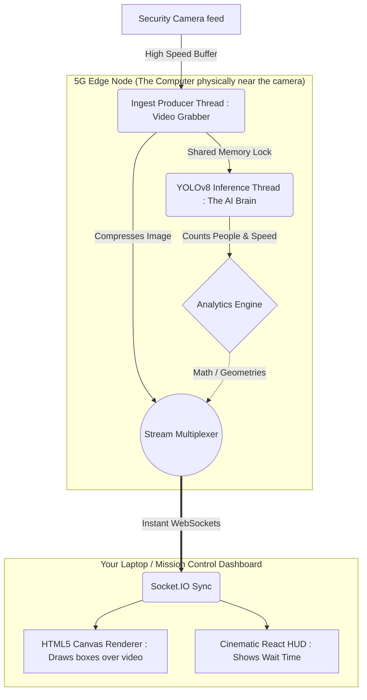

<div align="center">

# 🌐 5G Edge Network Queue Analytics

**An ultra-low latency, decentralized, AI-powered spatial crowd telemetry system.**

[](https://python.org)
[](https://flask.palletsprojects.com/)
[](https://reactjs.org/)
[](https://vitejs.dev/)
[](https://tailwindcss.com/)
[](https://developer.nvidia.com/cuda-toolkit)

</div>

---

## 📖 The Layman's Explanation (What does this actually do?)

Imagine you are managing a massive event (like a concert or a sports stadium) or a busy airport, and you have security cameras pointing at the security lines.

**The Problem:** Normally, to figure out how long the wait time is, someone has to watch the camera or a computer has to send high-definition video over the internet to a faraway cloud server. This is slow, expensive, and uses a massive amount of internet bandwidth.

**Our Solution (This Project):** We placed artificial intelligence (a "smart brain") physically *next* to the camera (this is what "**5G Edge**" means). 
1. The camera looks at the line.
2. The AI brain instantly draws little imaginary boxes around every person.
3. Instead of sending *video* to the internet (which is heavy and slow), the AI only sends the *math* (like "There are 15 people, and they are moving at this speed"). 
4. It sends this tiny sliver of math over ultra-fast 5G networks to a beautiful, futuristic dashboard on your screen in less than a blink of an eye.

The result is a system that watches queues and predicts exactly how long the wait time will be, instantly, and without slowing down the internet!

---

## 🚀 The Technical Vision

Traditional camera analytics suffer from heavy bandwidth constraints, cloud computing latency, and fragmented clumsy dashboards. 

This project solves this by moving **YOLOv8 Computer Vision directly to the 5G Edge**. It strips away heavy chunked image transmission, instead sending pure, serialized geometric metadata over ultra-fast WebSockets. The result? A **cinematic, GPU-accelerated client-side dashboard** that monitors spatial ROI (Region of Interest) queue wait times with absolute zero perceived lag.

<br>

<div align="center">
  
  <p><em>The cinematic "Mission Control" Aether Edge telemetry interface.</em></p>
</div>

---

## ⚡ Key Features

> [!TIP]
> **Why this matters:** This isn't just an AI script. It's a complete decoupled ecosystem engineered for production deployment on edge appliances.

*   **Real-time AI Pipeline (No Freezing)**: The system naturally balances itself. One part of the code grabs the video as fast as possible, while another part processes the AI math. If your computer isn't fast enough, it safely drops old frames instead of crashing or freezing.
*   **WebSockets + Binary Telemetry**: Traditional websites update every few seconds. We broadcast real-time metrics (`total_people`, `people_in_queue`, `density`, `estimated_wait`) constantly via Socket.IO, meaning your dashboard moves live.
*   **Decentralized Drawing (Less Work for the AI)**: Instead of the AI working hard to draw boxes on the video before sending it, we send the "idea" of the boxes to your web browser. Your web browser (the dashboard) uses built-in graphic power (HTML5 Canvas) to draw the boxes, saving massive amounts of energy for the AI.
*   **Advanced Wait-Time Math**: The system doesn't just guess; it calculates the exact flow tracking the density of people in the queue zone to dynamically predict how quickly the line will clear.

<br/>

## 🗺️ How The Data Flows

*(For deeper technical understanding of the architecture)*



---

## ⚙️ Getting Started (For Developers)

### 1️⃣ Dependencies & Requirements
You will need an environment capable of running **Python 3.10+** and **Node.js 18+**. 
(If you are on Windows, ensure the `C++ Build Tools` are installed if you plan on compiling deep-learning bindings manually).

### 2️⃣ Python Backend Setup
Initialize the AI inference engine which runs Flask and the ONNX models:

```bash
# Clone the repository
git clone https://github.com/ojas4414/5G_Usecase.git
cd 5G_Usecase

# Create a clean virtual environment and activate it
python -m venv venv
source venv/bin/activate  # On Windows use: .\venv\Scripts\activate

# Install AI plugins (Torch, ONNX, Flask-SocketIO)
pip install -r requirements.txt
```

### 3️⃣ Edge Config Optimization
Open `config.yaml` to configure your specific camera deployment point:

```yaml
node_id: "EDGE-NYC-5G-01"
roi_polygon:           # The coordinates defining the exactly drawn 'Queue' shape
  - [200, 200]
  - [800, 200]
  ...
video_source: 0        # Type '0' for a local webcam, or a camera web link "rtsp://..."
```

### 4️⃣ React Frontend Setup
Launch the dark-mode cybernetic dashboard:

```bash
cd frontend

# Install Vite, Tailwind v4, React, Chart.js dependencies
npm install

# Start the local development server natively 
npm run dev
```

---

## 🛸 Operation & Deployment

To launch the entire platform:

1.   **Start the AI Edge Protocol**:
     In terminal #1: `python app.py` 
     *The server will boot on `localhost:5000` and load the YOLOv8n.onnx graph.*
2.   **Start the Telemetry Interface**:
     In terminal #2: `cd frontend` then `npm run dev`
3.   Open your browser to: **`http://localhost:5173`**

You should instantly see the cybernetic landing section. Click **"View Live Dashboard"** to watch the real-time AI canvas rendering and telemetry metrics update instantaneously via WebSockets!

---

> [!IMPORTANT]
> **NVIDIA CUDA Hardware Acceleration**
> 
> The project utilizes `ONNX Runtime`. By default, it runs on your CPU. To utilize lightning-fast hardware acceleration (making the AI dramatically faster), ensure you have correctly installed your NVIDIA Drivers and the CUDA Toolkit. The `processor.py` engine will automatically hook into CUDA cores if discovered.

---

<div align="center">
<br/>
<p><b>Built to make lines faster through the power of Edge computing.</b></p>
<p><i>© 2026 // NODE: EDGE-NYC-5G-01</i></p>
</div>
