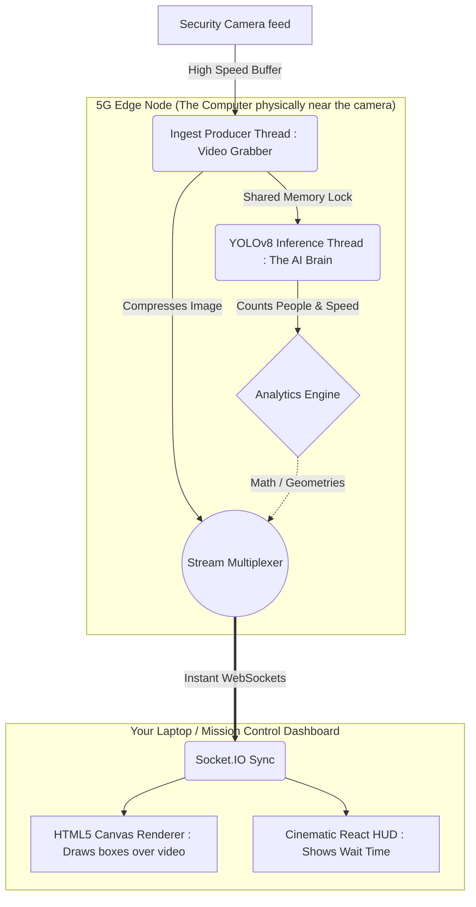

<div align="center">

# 🌐 5G Edge Network Queue Analytics

**An ultra-low latency, decentralized, AI-powered spatial crowd telemetry system.**

[](https://python.org)
[](https://flask.palletsprojects.com/)
[](https://reactjs.org/)
[](https://vitejs.dev/)
[](https://tailwindcss.com/)
[](https://developer.nvidia.com/cuda-toolkit)

</div>

---

## 📖 The Layman's Explanation (What does this actually do?)

Imagine you are managing a massive event (like a concert or a sports stadium) or a busy airport, and you have security cameras pointing at the security lines.

**The Problem:** Normally, to figure out how long the wait time is, someone has to watch the camera or a computer has to send high-definition video over the internet to a faraway cloud server. This is slow, expensive, and uses a massive amount of internet bandwidth.

**Our Solution (This Project):** We placed artificial intelligence (a "smart brain") physically *next* to the camera (this is what "**5G Edge**" means). 
1. The camera looks at the line.
2. The AI brain instantly draws little imaginary boxes around every person.
3. Instead of sending *video* to the internet (which is heavy and slow), the AI only sends the *math* (like "There are 15 people, and they are moving at this speed"). 
4. It sends this tiny sliver of math over ultra-fast 5G networks to a beautiful, futuristic dashboard on your screen in less than a blink of an eye.

The result is a system that watches queues and predicts exactly how long the wait time will be, instantly, and without slowing down the internet!

---

## 🧠 System Architecture & Design Choices (Why we used what we used)

Traditional camera analytics suffer from heavy bandwidth constraints, cloud computing latency, and fragmented clumsy dashboards. This project solves this by moving processing directly to the **5G Edge** and utilizing modern decentralized data flows.

### 1. The AI Model: YOLOv8 + BoT-SORT Tracking
*   **Why YOLOv8?** YOLOv8 (specifically the Nano/`yolov8n.onnx` variant) was chosen because it provides the best balance between mean Average Precision (mAP) and inference speed on Edge devices. It allows us to process frames in real-time natively on CUDA-enabled GPUs or even modern CPUs.
*   **Why BoT-SORT/ByteTrack?** Object detection alone just gives us bounding boxes. To calculate "Wait Time", we need to track *unique individuals* over time. By enabling tracking (`persist=True`), the model assigns temporal IDs. If Person #4 enters a queue zone and leaves 30 seconds later, the tracker allows our math engine to record a 30-second service time.

### 2. Why 5G Networks & 5G Cameras?
*   **The Logic:** The system is designed around wireless 5G IP cameras communicating directly with a local 5G MEC (Multi-access Edge Computing) node.
*   **Why?** In massive environments like airports, stadiums, or outdoor festivals, running physical fiber/Ethernet cables to hundreds of cameras is cost-prohibitive or impossible. Traditional Wi-Fi completely fails under high-density crowd interference. 5G provides **eMBB** (high uplink bandwidth) and **URLLC** (ultra-reliable low latency) ensuring frames reach the processor in milliseconds. Most importantly, 5G MEC routes the data to a local edge server *at the cell tower site*, completely avoiding the massive latency and bandwidth costs of sending raw video over the public internet to AWS/GCP.

### 3. Adaptive Computation Offloading
*   **The Logic:** In `processor.py`, the system dynamically checks the 5G network latency. If latency spikes above 50ms, the engine downscales the YOLO inference resolution from `640x640` to `320x320`.
*   **Why?** In degraded URLLC/eMBB 5G slice conditions, the network becomes the bottleneck. By reducing resolution, we drastically speed up the inference time, reducing thermal load on the edge node and compensating for the network delay, ensuring the pipeline doesn't freeze.

### 4. Spatial Geometry & Multi-Queue Logic
*   **The Logic:** Instead of tracking the whole frame, we use the `Shapely` library to define arbitrary polygonal "Queue Zones". We map the bottom-center of every tracked bounding box to see if it intersects with a specific polygon.
*   **Why?** A single edge camera might point at 3 different checkout lanes. By checking geometric intersections, we can monitor the wait time, density, and crowd pressure of *each lane independently* without needing 3 separate cameras or AI models.

### 5. Ring-Buffer Stream Management
*   **The Logic:** The `VideoStream` class in `stream_manager.py` uses a `queue.Queue(maxsize=1)`. The camera producer writes frames as fast as possible; if the queue is full, it evicts the old frame and writes the new one.
*   **Why?** In standard OpenCV, if the camera captures 60 frames per second but the AI processes 30, a buffer builds up. After 1 minute, the AI is analyzing the past! The ring-buffer ensures the AI *always* grabs the freshest, absolute-lowest-latency frame.

### 6. Transport Layer: Binary WebSockets
*   **The Logic:** Telemetry is serialized via Python's `struct.pack` into binary bytes and streamed via Socket.IO.
*   **Why?** Standard REST APIs (HTTP GET/POST) have massive header overhead and require polling. WebSockets keep a persistent pipe open. Furthermore, sending binary bytes instead of JSON text cuts the payload size by over 70%, critical for saving 5G bandwidth.

### 7. Client-Side Rendering: HTML5 Canvas + React
*   **The Logic:** The Python backend does *not* draw bounding boxes on the video. It sends a clean low-quality video frame, and streams the bounding box coordinates as metadata. The React frontend uses an HTML5 `<canvas>` to draw the boxes locally.
*   **Why?** Drawing boxes and text via OpenCV (`cv2.rectangle`) is CPU-intensive. By sending pure coordinate math, we offload the rendering effort to the user's local web browser (which naturally utilizes GPU acceleration), freeing up vital compute cycles on the 5G Edge Node.

<br>

<div align="center">
  <p><em>The cinematic "Mission Control" telemetry interface built with React & Tailwind CSS.</em></p>
</div>

---

## ⚡ System Features & Subsystems

> [!TIP]
> **Why this matters:** This isn't just an AI script. It's a complete decoupled ecosystem engineered for production deployment on edge appliances.

*   **Real-time AI Pipeline**: Zero-backlog producer-consumer threading.
*   **Dual Network Modes**: 
    *   *Simulated Mode:* Injects configurable latency/drops to test edge-case failure modes without needing a live 5G environment.
    *   *Real Camera Mode:* Uses a background ICMP probe thread to ping the IP camera, feeding *actual* network RTT (Round Trip Time) into the adaptive AI logic.
*   **Multi-Queue Tracking**: Dynamically tracks `Lane 1`, `Lane 2`, etc., computing localized densities and dynamic Lambda service rates (Little's Law).
*   **Camera Auto-Discovery**: Includes a `camera_finder.py` utility that automatically scans local subnets and tests RTSP/MJPEG protocols to effortlessly find live streams.
*   **Headless Benchmarking**: Includes an `evaluate.py` script for empirical latency and payload-size metric gathering.

<br/>

## 🗺️ How The Data Flows

*(For deeper technical understanding of the architecture)*



---

## ⚙️ Getting Started (For Developers)

### 1️⃣ Dependencies & Requirements
You will need an environment capable of running **Python 3.10+** and **Node.js 18+**. 
(If you are on Windows, ensure the `C++ Build Tools` are installed if you plan on compiling deep-learning bindings manually).

### 2️⃣ Python Backend Setup
Initialize the AI inference engine which runs Flask and the ONNX models:

```bash
# Clone the repository
git clone https://github.com/ojas4414/5G_Usecase.git
cd 5G_Usecase

# Create a clean virtual environment and activate it
python -m venv venv
.\venv\Scripts\activate

# Install AI plugins (Torch, ONNX, Flask-SocketIO)
pip install -r requirements.txt
```

### 3️⃣ Edge Config Optimization
Open `config.yaml` to configure your specific camera deployment point:

```yaml
node_id: "EDGE-NYC-5G-01"
use_real_camera: false     # Set to true to use RTSP/HTTP streams and live ICMP probes

# Multi-Queue Zones Example
queue_zones:
  - id: lane_a
    name: Queue A
    polygon:
      - [200, 200]
      - [500, 200]
      - [500, 600]
      - [200, 600]
    area_sqm: 5.0
    queue_wait_threshold_sec: 5.0
```

### 4️⃣ React Frontend Setup
Launch the dark-mode cybernetic dashboard:

```bash
cd frontend

# Install Vite, Tailwind v4, React, Chart.js dependencies
npm install

# Start the local development server natively 
npm run dev
```

---

## 🛸 Operation & Deployment

To launch the entire platform:

1.   **Start the AI Edge Protocol**:
     In terminal #1: `python app.py` 
     *The server will boot on `localhost:5000` and load the YOLOv8n.onnx graph.*
2.   **Start the Telemetry Interface**:
     In terminal #2: `cd frontend` then `npm run dev`
3.   Open your browser to: **`http://localhost:5173`**

You should instantly see the cybernetic landing section. Click **"View Live Dashboard"** to watch the real-time AI canvas rendering and telemetry metrics update instantaneously via WebSockets!

---

> [!IMPORTANT]
> **NVIDIA CUDA Hardware Acceleration**
> 
> The project utilizes `ONNX Runtime`. By default, it runs on your CPU. To utilize lightning-fast hardware acceleration (making the AI dramatically faster), ensure you have correctly installed your NVIDIA Drivers and the CUDA Toolkit. The `processor.py` engine will automatically hook into CUDA cores if discovered.

---

<div align="center">
<br/>
<p><b>Built to make lines faster through the power of Edge computing.</b></p>
<p><i>© 2026 // NODE: EDGE-NYC-5G-01</i></p>
</div>
